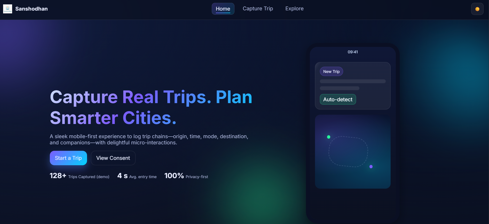

# Sanshodhan
Sanshodhan logs trips and feedback to power smarter, safer, cleaner city transport planning.
# Sanshodhan – Smart Travel Capture (Frontend)

<div align="center">


<p>
  
</p>

</div>

## Overview
Sanshodhan is a mobile‑first, multi‑page web app to capture trip details and traveler feedback, designed for SIH. It lets users log trip chains (origin, time, mode, destination, companions) and provide infrastructure feedback. The UI is modern, animated, and privacy‑respecting; this build runs fully in the browser with local storage.

## Key Features
- Trip Capture: Origin, time, mode, destination, companions, purpose, notes
- Integrated Feedback: Options-based infrastructure questions saved with each trip
- Explore: Live location tracking and nearby facilities (OSM lookup + offline fallback)
- UX Polish: Animations, glassmorphism, gradients, ripple, hover lifts
- Dark/Light Mode: Toggle with persistence and system preference fallback
- Local-First: Data stored in browser localStorage in this version

## Pages
- index.html – Home: hero, features, CTA
- trip.html – Capture Trip: trip form + feedback + recent trips
- explore.html – Explore: live location + nearby finder
- consent.html – Consent & Privacy: consent toggle and policy

## Tech Stack
- HTML, CSS, JavaScript (no frameworks)
- CSS: Inter font, gradients, glassmorphism, responsive grid
- JS: Local storage, navigation transitions, geolocation, fetch to OpenStreetMap Nominatim

## Project Structure
```
travel web/
  index.html
  trip.html
  explore.html
  consent.html
  assets/
    css/
      style.css
    js/
      main.js
    icon.svg
  Logo.jpg
```

## Screenshots
Add PNG/JPG files to `assets/` and the images will render here. You can rename if you prefer.

<p align="center">
  
</p>

<p align="center">
  
</p>

<p align="center">
  
</p>

## Getting Started
Open directly or serve locally (recommended for geolocation):
```
# Python 3
python -m http.server 8080
# Node
npx serve -l 8080
```
Go to http://localhost:8080.

## Usage
- Home → Start a trip
- Capture Trip:
  - Start time auto-fills; origin can be auto-filled (mock for smoother demo)
  - Pick travel mode (chips), fill destination, companions, purpose
  - Fill feedback dropdowns (availability/cleanliness/roads/etc.)
  - Submit → entry appears under Recent Trips
- Explore:
  - Live Location: Start/Stop geolocation (falls back to mock path)
  - Nearby: Choose type (Hospital/ATM/Fuel/Bus Stop) → OSM search with offline fallback
- Consent: Toggle consent; stored locally

## Privacy & Consent
- All data in this build stays in your browser (localStorage).
- Geolocation permission is requested only when you press Start in Explore.
- Consent state is stored locally; copy reflects a production stance.

## Customization
- Branding: Replace Logo.jpg, update brand text “Sanshodhan” in headers
- Colors/Effects: Tweak CSS variables in assets/css/style.css (:root and body.light)
- Feedback Questions: Edit the feedback section in trip.html and the feedback object in assets/js/main.js
- Nearby Types: Update the select in explore.html and handling in Explore init in main.js

## Deployment (GitHub Pages)
1. Push this folder to a GitHub repository
2. Settings → Pages → Source: main (root) → Save
3. Your site will be served at the GitHub Pages URL

If using a docs/ folder, move files into docs/ and point Pages there.

## Screenshots (optional)
Add images to assets/ and reference:
```


```

## Roadmap
- Backend API + auth and secure uploads
- Trip-chain auto-detection and background inference
- Offline-first sync + conflict resolution
- Rich maps and route visualization
- Multi-language support and CSV/JSON export

## Known Limitations
- Frontend-only build; state persists in local storage
- OSM Nominatim usage is subject to rate limiting/CORS

## Development Notes
- Animations respect prefers-reduced-motion
- Mobile-first responsive layout
- Button ripple and nav underline micro-interactions implemented without libraries

## License
MIT (or update to your preferred license)

## Contact
- Email: tanmaysatpute18@gmail.com
- Phone: +91 7666818878
